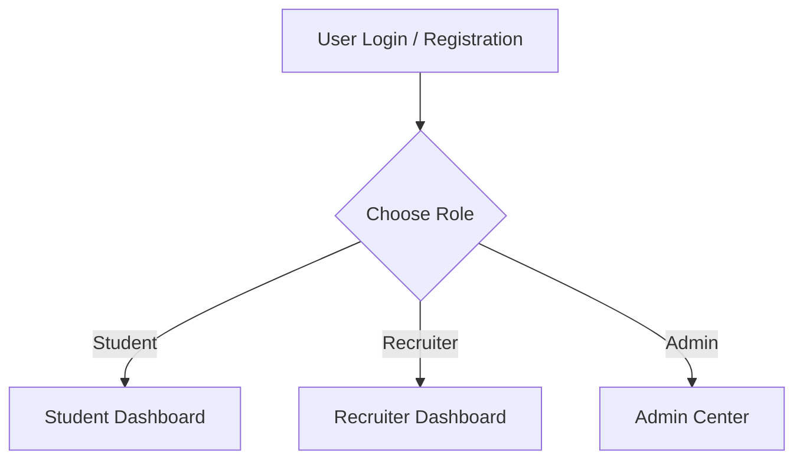
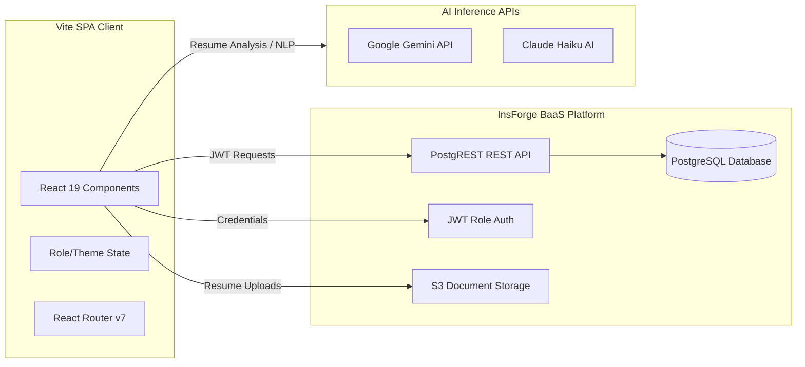

# 🎓 Placify — AI-Powered Campus Placement Platform

<p align="center">
  
  
  
</p>

<p align="center">
  <b>Placify</b> is a full-stack, enterprise-grade campus placement management platform. It bridges the gap between <b>Students</b> seeking jobs, <b>Recruiters</b> seeking top talent through natural language AI search, and <b>Placement Administrators</b> coordinating drives.
</p>

---

## 📌 Table of Contents

* [📖 Project Overview](#-project-overview)
* [🛠️ Tech Stack & Badges](#%EF%B8%8F-tech-stack--badges)
* [✨ Core Features](#-core-features)
  * [🔐 Role-Based Access Control](#-role-based-access-control)
  * [🤖 AI Student Explorer & ATS Resume Analysis](#-ai-student-explorer--ats-resume-analysis)
  * [💻 Monaco Code Simulator](#-monaco-code-simulator)
  * [📚 LeetCode DSA Sheets](#-leetcode-dsa-sheets)
* [🏗️ System Architecture](#%EF%B8%8F-system-architecture)
* [📁 Folder Structure](#-folder-structure)
* [🗄️ Database Schema Design](#%EF%B8%8F-database-schema-design)
* [🚀 Getting Started](#-getting-started)
* [⚙️ Environment Variables](#%EF%B8%8F-environment-variables)
* [🌐 Deployment](#-deployment)
* [🐍 Trendy GitHub Profile Highlights (Bonus)](#-trendy-github-profile-highlights-bonus)
* [📄 License](#-license)

---

## 📖 Project Overview

Campus placements are traditionally managed through fragmented spreadsheets, email threads, and manual resume collections. **Placify** unifies this workflow by providing a PostgreSQL-backed BaaS system paired with natural-language AI filters. Recruiters can search for candidates using plain English queries, parse resumes with AI to auto-tag skills, and manage applications in real time.

---

## 🛠️ Tech Stack & Badges

Placify is built using modern, fast, and light-weight libraries:

| Layer | Technologies & Badges |
|---|---|
| **Core Framework** |   |
| **Build & Tooling** |    |
| **Styling** |   |
| **Backend (BaaS)** |  (Postgres, Auth, Storage) |
| **Artificial Intelligence** |   |
| **Libraries** |   |

---

## ✨ Core Features

### 🔐 Role-Based Access Control

The application implements a secure three-tier RBAC system:



*   **Student portal**: Dashboard analytics, live placement drives, interactive resume builder, Monaco code simulator, alumni database, off-campus drive locator.
*   **Recruiter portal**: Create and post job listings, check applicant requirements, search candidate pool using natural language query explorer.
*   **Admin panel**: Track overall campus statistics (placed vs unplaced, branch-wise percentages, top recruiters), verify students, audit system activity logs.

---

### 🤖 AI Student Explorer & ATS Resume Analysis

Placify integrates Gemini and Claude AI models directly into the search console:

*   **Natural Language Filters**: Recruiters search by typing queries like `"Find CSE students with CGPA above 8.5 who know React"` or `"Show me 2026 batch candidates skilled in Python"`. The AI parses the request into SQL-compliant database filters.
*   **Fallback Regex NLP Parser**: If the API key is not configured, the local regular expression engine extracts CGPA ranges, branch patterns, and over 50+ technology keywords seamlessly.
*   **ATS Metadata Parser**: Evaluates candidate resumes (PDF/Word), extracts summarized bullet points, auto-generates category tags, and rates experience level.

---

### 💻 Monaco Code Simulator

An integrated coding playground powered by the Monaco Editor engine (VS Code source core):
*   Real-time syntax highlighting for C++, Java, Python, and JavaScript.
*   In-browser output simulator.
*   Pre-loaded interview questions with direct code evaluation.

---

### 📚 LeetCode DSA Sheets

A preparation module displaying two curated tracks:
1.  **LeetCode 75**: Essential algorithmic pattern exercises.
2.  **Top Interview 150**: The most frequently asked placements questions.
*   **Features**: Difficulty filtering, active checkmark progress tracking, direct links to code files, and target company tags.

---

## 🏗️ System Architecture

Placify uses a client-heavy Single Page Application (SPA) architecture combined with a serverless PostgreSQL Backend-as-a-Service layer:



---

## 📁 Folder Structure

The repository is structured following strict clean architecture practices:

```
placify/
├── docs/                     # Project documentation & reference sheets
├── database/                 # Database schema migrations & SQL scripts
├── public/                   # Static public assets
├── src/
│   ├── assets/               # Local images and svg icons
│   ├── components/           # Reusable UI component modules
│   ├── constants/            # Shared static configurations
│   ├── context/              # Global React Contexts
│   ├── layouts/              # Multi-layout shells
│   ├── lib/                  # Third-party wrapper integrations
│   ├── modules/              # Feature modules grouped by user role
│   ├── pages/                # High-level route pages
│   ├── routes/               # Routing declarations
│   ├── styles/               # CSS and styles
│   ├── utils/                # Functional utility helpers
│   ├── App.tsx               # Main application container
│   └── main.tsx              # Application entrypoint
├── .env.example              # Template for environment variables
├── .editorconfig             # Editor configuration preferences
├── .prettierrc               # Formatting settings
├── LICENSE                   # MIT License
├── package.json
├── tailwind.config.js
└── vite.config.ts
```

---

## 🗄️ Database Schema Design

Placify's backend runs on 9 structured PostgreSQL tables:

```
+------------------+       +------------------+       +-------------------+
|     students     |       |       jobs       |       |   applications    |
+------------------+       +------------------+       +-------------------+
| id (UUID, PK)    |       | id (UUID, PK)    |       | id (UUID, PK)     |
| name (TEXT)      |       | title (TEXT)     |       | student_id (FK)   |
| cgpa (NUMERIC)   |       | company (TEXT)   |       | job_id (FK)       |
| branch (TEXT)    |       | ctc (NUMERIC)    |       | status (TEXT)     |
| resume_url (TEXT)|       | location (TEXT)  |       | applied_at (DATE) |
+------------------+       +------------------+       +-------------------+
```

### Table Definitions

1.  **`students`**: Personal profile, CGPA, graduation batch, skills list, and resume storage links.
2.  **`recruiters`**: Company info, designation, contact numbers.
3.  **`admins`**: Administrator tracking metadata.
4.  **`jobs`**: Location, role descriptions, CTC value, and branch eligibility keys.
5.  **`applications`**: Application states (`Applied`, `Shortlisted`, `Offered`, `Rejected`).
6.  **`forum_threads`**: Community topics with title, author, category, and upvote counts.
7.  **`student_ai_profiles`**: AI analyzed tags, extracted resume text summary, and parsed technology keywords.
8.  **`dsa_questions`**: LeetCode problem links, difficulties, and categorization.
9.  **`dsa_companies`**: Placement tags linking target companies to target questions.

---

## 🚀 Getting Started

### Prerequisites
*   Node.js 18+
*   npm or yarn

### Local Setup Instructions

1.  **Clone the repository**:
    ```bash
    git clone https://github.com/Aakash-780/Placify.git
    cd Placify
    ```

2.  **Install dependencies**:
    ```bash
    npm install
    ```

3.  **Set up environment variables**:
    ```bash
    cp .env.example .env
    # Edit the file with your credentials
    ```

4.  **Launch the development server**:
    ```bash
    npm run dev
    ```

5.  **Build production artifacts**:
    ```bash
    npm run build
    npm run preview
    ```

---

## ⚙️ Environment Variables

Create a `.env` file in the root folder with the following variables:

```env
# InsForge Database & API Keys
VITE_INSFORGE_BASE_URL=https://39s3r2sh.ap-southeast.insforge.app
VITE_INSFORGE_ANON_KEY=your_insforge_anonymous_key

# Google Gemini API key (Used for Resume Metadata Parsing)
VITE_GEMINI_API_KEY=your_gemini_api_key

# Grok (xAI) API key (AI Fallback Backup)
VITE_GROK_API_KEY=your_grok_api_key

# CloudConvert API keys (Used for PDF/Word resume conversions)
VITE_CONVERT_API_SECRET=your_convert_api_secret
VITE_CLOUDCONVERT_API_KEY=your_cloudconvert_api_key
```

---

## 🌐 Deployment

The frontend of Placify is compiled to a static Single Page Application and hosted on Vercel.

To push new deployments:
```bash
# Verify the build compiles correctly
npm run build

# Deploy to InsForge hosting environment
npx @insforge/cli deployments deploy . --env '{"VITE_INSFORGE_BASE_URL":"https://39s3r2sh.ap-southeast.insforge.app"}'
```

---

## 🐍 Trendy GitHub Profile Highlights (Bonus)

To make your GitHub profile standout like modern developer profiles, you can showcase **Placify** using interactive badges and status blocks.

### 🎮 Contribution Graph Snake Game
You can configure a GitHub Action to generate a contribution snake animation that "eats" your commit pixels.

1. Create a workspace file `.github/workflows/snake.yml` in your profile repository:
```yaml
name: Generate Snake Animation

on:
  schedule: # Run every 12 hours
    - cron: "0 */12 * * *"
  workflow_dispatch:

jobs:
  build:
    runs-on: ubuntu-latest
    steps:
      - name: Generate Contribution Snake
        uses: Platane/snk@v3
        with:
          github_user_name: Aakash-780
          outputs: |
            dist/github-contribution-grid-snake.svg
            dist/github-contribution-grid-snake-dark.svg?palette=github-dark
```

2. Embed the output image in your Profile `README.md`:
```markdown

```

---

## 📄 License

This project is licensed under the [MIT License](file:///Users/aakashsrivastava/Desktop/New%20Career%20Bridge/LICENSE).

---

*Built with ❤️ using React, TypeScript, InsForge, and Claude AI*
