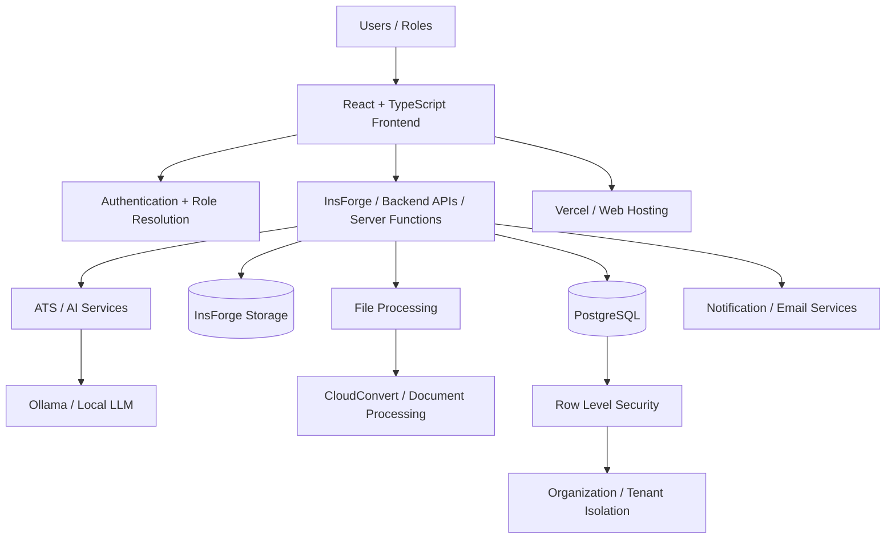
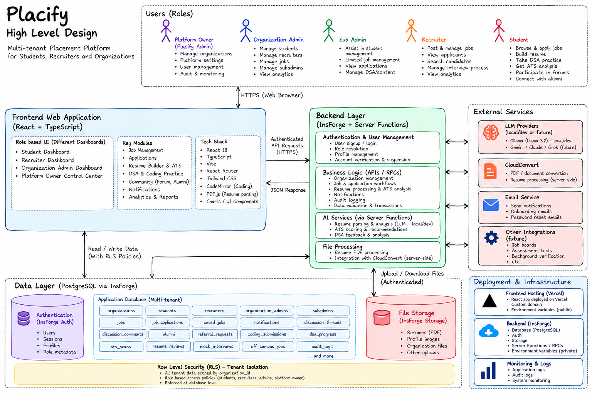
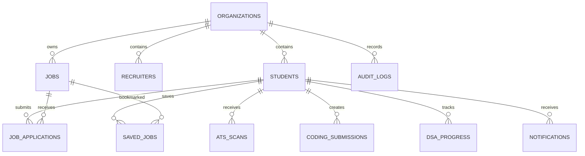

# Placify

**Placement management is broken by spreadsheets. We replace it with one platform.**

[](https://react.dev)
[](https://www.typescriptlang.org)
[](https://www.postgresql.org)
[](https://deepmind.google/technologies/gemini/)
[](LICENSE)

## Overview

Placify is an **AI-powered, multi-tenant campus placement platform** that gives every stakeholder in campus recruitment — universities, placement cells, recruiters, and students — a single dedicated workspace instead of scattered spreadsheets, emails, and disconnected tools.

A single deployment can serve many universities at once. Each organization gets its own admins, students, recruiters, and placement drives, fully isolated from every other organization on the platform.

Recruiters search candidates in plain English. Students get their resumes scored and rewritten by AI. Placement cells run drives, verify students, and track outcomes — all from one dashboard.

---

## The Problem

Campus placement today runs on spreadsheets, forwarded emails, and a patchwork of forms. Placement cells manually cross-check eligibility, recruiters chase applicant lists over email, and students have no single place to track applications, prepare for interviews, or know how their resume stacks up.

None of these tools talk to each other. Every placement season, the same manual work gets repeated — and nothing about it scales as the number of students, recruiters, or partner organizations grows.

---

## What It Does

| Step | Action | Description |
|---|---|---|
| 01 | **Onboard** | A university signs up as an organization; the platform owner provisions its admin and isolates its data from every other tenant |
| 02 | **Manage** | Admins verify students, approve recruiters, and launch placement drives from a single dashboard |
| 03 | **Prepare** | Students build resumes, get an AI-driven ATS score, and practice DSA and coding interviews |
| 04 | **Hire** | Recruiters describe the candidate they want in plain English, shortlist, and run interviews — all inside Placify |

---

## Features

- **AI Candidate Explorer** — recruiters type a request like *"AI/ML students graduating in 2027 with React and Python, CGPA above 8.5"* and Placify turns it into a database query automatically
- **ATS Resume Analyzer** — extracts skills, scores resumes against ATS criteria, flags missing keywords, and recommends fixes
- **Monaco Code Simulator** — an in-browser coding environment for C++, Java, Python, and JavaScript with execution and progress tracking
- **DSA Preparation** — curated problem sets (LeetCode 75, Top Interview 150, company-wise lists) with notes and difficulty filters
- **Community Forum** — students share resources, ask questions, and learn from seniors' interview experiences
- **Multi-Tenant Isolation** — every table is scoped to an organization, enforced at the database level with Row Level Security


---

# User Roles

| Role | Primary Responsibilities |
|---|---|
| **Platform Owner** | Manage organizations, platform settings, users, audit/monitoring workflows |
| **Organization Admin** | Manage organization users, recruiters, students, jobs, sub-admins and analytics |
| **Sub Admin** | Assist with students, recruiters, applicants, jobs, DSA/content and operational workflows |
| **Recruiter** | Manage recruiter profile, jobs, applicants, candidate discovery and hiring workflows |
| **Student** | Discover jobs, apply, manage resume, practice coding/DSA, track applications and participate in community features |

---


# High-Level Architecture


```mermaid
flowchart TB

    U[Users / Roles]

    U --> FE[React + TypeScript Frontend]

    FE --> AUTH[Authentication + Role Resolution]
    FE --> API[InsForge / Backend APIs / Server Functions]

    API --> DB[(PostgreSQL)]
    API --> STORAGE[(InsForge Storage)]

    API --> ATS[ATS / AI Services]
    API --> FILES[File Processing]

    ATS --> OLLAMA[Ollama / Local LLM]
    FILES --> CC[CloudConvert / Document Processing]

    API --> NOTIFY[Notification / Email Services]

    DB --> RLS[Row Level Security]
    RLS --> TENANT[Organization / Tenant Isolation]

    FE --> VERCEL[Vercel / Web Hosting]
```


## Architecture



```
---

# Technology Stack

## Frontend

- **React 19**
- **TypeScript**
- **Vite**
- **React Router**
- **Tailwind CSS**
- **Radix UI**
- **Lucide React**
- **Recharts**
- **CodeMirror 6**
- **React Dropzone**
- **React Resizable Panels**

## Backend / Platform

- **InsForge**
- **PostgreSQL**
- **Authentication**
- **Database APIs**
- **Storage**
- **Server Functions / RPC-oriented Workflows**

## AI / Resume Processing

- **Ollama**
- **Llama 3.2** (local/development configuration)
- **ATS Scoring and Heuristic Fallback Logic**
- **PDF.js**
- **Mammoth.js** for DOCX processing
- **CloudConvert** integration for document conversion

## Tooling

- **ESLint**
- **TypeScript ESLint**
- **PostCSS**
- **Autoprefixer**
- **Vite Build Tooling**

---

# Project Structure

```text
Placify/
│
├── database/
│   ├── 00_create_base_schema.sql
│   ├── 01_schema_migrations.sql
│   ├── 01a_schema_job_applications_form.sql
│   ├── 01b_schema_admins_profile.sql
│   ├── 01c_schema_coding_progress.sql
│   ├── 01d_fix_coding_progress_schema.sql
│   ├── 02_seed_students.sql
│   ├── 03_seed_job_applications.sql
│   ├── 04_seed_jobs.sql
│   ├── 07_create_notifications_schema.sql
│   ├── 09_super_admin_schema.sql
│   ├── 10_multi_tenant_schema.sql
│   ├── 11_org_admin_schema.sql
│   └── 12_multi_tenant_rls.sql
│
├── docs/
│   ├── AI_Explorer_Architecture.md
│   ├── project_context.md
│   ├── project_report.md
│   └── learning_insforge_instructions.md
│
├── src/
│   ├── assets/
│   ├── components/
│   │   ├── auth/
│   │   ├── guards/
│   │   ├── layout/
│   │   ├── loaders/
│   │   ├── navbar/
│   │   ├── sidebar/
│   │   └── ui/
│   │
│   ├── constants/
│   ├── context/
│   ├── data/
│   ├── layouts/
│   │
│   ├── modules/
│   │   ├── organization-admin/
│   │   ├── recruiter/
│   │   ├── student/
│   │   └── subadmin/
│   │
│   ├── pages/
│   ├── routes/
│   ├── services/
│   │   ├── ats-ai/
│   │   └── notificationService.ts
│   │
│   ├── styles/
│   ├── utils/
│   └── lib/
│
├── public/
├── .env.example
├── eslint.config.js
├── package.json
├── postcss.config.js
├── tailwind.config.js
├── tsconfig.json
├── vite.config.ts
└── vercel.json
```

---


## Getting Started

### Prerequisites

- Node.js 18 or higher
- An InsForge project (database, auth, storage)
- API keys for Google Gemini and/or Grok

### Installation

```bash
# Clone the repository
git clone https://github.com/Aakash-780/Placify.git
cd Placify

# Install dependencies
npm install

# Configure environment
cp .env.example .env
# Open .env and add your keys

# Run the application
npm run dev
```

Open `http://localhost:5173` in your browser.

### Production build

```bash
npm run build
npm run preview
```

---

## Configuration

Create a `.env` file in the project root:

```env
VITE_INSFORGE_BASE_URL=
VITE_INSFORGE_ANON_KEY=
VITE_GEMINI_API_KEY=
VITE_GROK_API_KEY=
VITE_CLOUDCONVERT_API_KEY=
```

---

---

# Core Modules

## Student Module

```text
src/modules/student/
├── pages/
│   ├── Dashboard.tsx
│   ├── Jobs.tsx
│   ├── ApplyJob.tsx
│   ├── MyApplications.tsx
│   ├── ApplicationDetails.tsx
│   ├── ResumeBuilder.tsx
│   ├── CodeSimulator.tsx
│   ├── DsaSheets.tsx
│   ├── Forum.tsx
│   ├── ForumThread.tsx
│   ├── Alumni.tsx
│   ├── Notifications.tsx
│   ├── Profile.tsx
│   └── OffCampus.tsx
```

## Recruiter Module

```text
src/modules/recruiter/
├── components/
│   └── RecruiterOnboarding.tsx
└── pages/
    ├── RecruiterJobs.tsx
    └── RecruiterProfile.tsx
```

## Organization Admin Module

```text
src/modules/organization-admin/
└── pages/
    ├── OrgAdminDashboard.tsx
    ├── OrgStudentsPage.tsx
    ├── OrgRecruitersPage.tsx
    ├── OrgSubadminsPage.tsx
    ├── OrgSettingsPage.tsx
    ├── OrgAuditLogsPage.tsx
    └── SuperAdminsPage.tsx
```

## Sub Admin Module

```text
src/modules/subadmin/
└── pages/
    ├── Students.tsx
    ├── Recruiters.tsx
    ├── Applicants.tsx
    ├── PostJob.tsx
    ├── StudentExplorer.tsx
    ├── Analytics.tsx
    ├── MentorVerification.tsx
    ├── AdminDsaSheets.tsx
    └── OffCampusManagement.tsx
```

---
A simplified relationship model:


```mermaid
erDiagram

    ORGANIZATIONS ||--o{ STUDENTS : contains
    ORGANIZATIONS ||--o{ RECRUITERS : contains
    ORGANIZATIONS ||--o{ JOBS : owns

    STUDENTS ||--o{ JOB_APPLICATIONS : submits
    JOBS ||--o{ JOB_APPLICATIONS : receives

    STUDENTS ||--o{ SAVED_JOBS : saves
    JOBS ||--o{ SAVED_JOBS : bookmarked

    STUDENTS ||--o{ ATS_SCANS : receives
    STUDENTS ||--o{ CODING_SUBMISSIONS : creates
    STUDENTS ||--o{ DSA_PROGRESS : tracks

    STUDENTS ||--o{ NOTIFICATIONS : receives
    ORGANIZATIONS ||--o{ AUDIT_LOGS : records
```

---

---

## Installation

Clone the repository:

```bash
git clone <YOUR_REPOSITORY_URL>
cd Placify
```

Install dependencies:

```bash
npm install
```

Create your local environment file:

```bash
cp .env.example .env
```

Populate the required values.

Start the development server:

```bash
npm run dev
```

The Vite development server will print the local URL in the terminal.

---

# Environment Variables

Create a `.env` file based on `.env.example`.

```env
# InsForge
VITE_INSFORGE_BASE_URL=https://your-project-id.region.insforge.app
VITE_INSFORGE_ANON_KEY=your_insforge_anonymous_key

# Local AI / Ollama
VITE_OLLAMA_URL=http://localhost:11434
VITE_OLLAMA_MODEL=llama3.2
VITE_USE_AI_ATS=true
```

### Important security rule

Do **not** place private server-side credentials in variables prefixed with `VITE_`.

Vite exposes `VITE_*` variables to the browser bundle.

Private API credentials should be handled by server-side functions or a backend service.

---
## Roadmap

- [ ] AI mock interviews
- [ ] Video interview platform
- [ ] Company assessment portal
- [ ] Interview scheduling
- [ ] Email automation
- [ ] Placement prediction using ML
- [ ] Resume ranking engine
- [ ] Mobile application

---


## License

This project is licensed under the MIT License. See [LICENSE](LICENSE) for details.

---

**Placify** — one platform for every stakeholder in campus placement.
