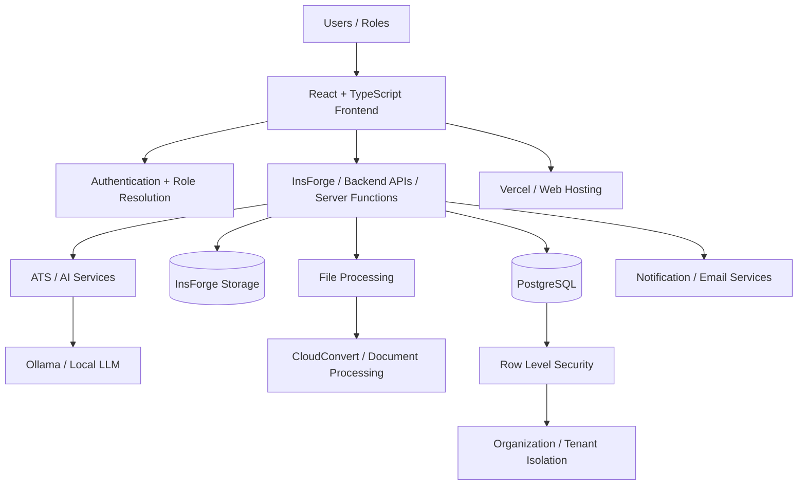
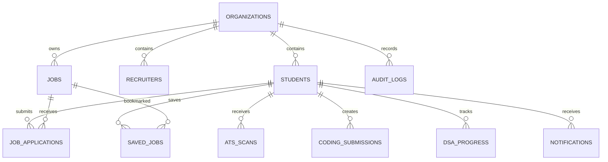

# Placify — AI-Powered Multi-Tenant Campus Placement Platform

> **Placify** is a full-stack-ready campus placement and recruitment management platform built with **React, TypeScript, Vite, PostgreSQL, InsForge, role-based access control, multi-tenant data modeling, resume/ATS analysis, DSA practice, coding practice, recruiter workflows, student applications, notifications, analytics, and community features**.

[](https://react.dev/)
[](https://www.typescriptlang.org/)
[](https://vite.dev/)
[](https://www.postgresql.org/)
[](https://tailwindcss.com/)
[](LICENSE)

---

## Table of Contents

- [Overview](#overview)
- [Problem Statement](#problem-statement)
- [Key Features](#key-features)
- [User Roles](#user-roles)
- [High-Level Architecture](#high-level-architecture)
- [Technology Stack](#technology-stack)
- [Project Structure](#project-structure)
- [Core Modules](#core-modules)
- [Data Model](#data-model)
- [Authentication and Authorization](#authentication-and-authorization)
- [AI and ATS Pipeline](#ai-and-ats-pipeline)
- [Local Development](#local-development)
- [Environment Variables](#environment-variables)
- [Available Scripts](#available-scripts)
- [Database and Migrations](#database-and-migrations)
- [Security Considerations](#security-considerations)
- [Performance and Scalability](#performance-and-scalability)
- [Deployment](#deployment)
- [Engineering Design Notes](#engineering-design-notes)
- [Roadmap](#roadmap)
- [Contributing](#contributing)
- [License](#license)
- [Project Keywords](#project-keywords)

---

## Overview

Placify is designed as a **multi-tenant placement management system** for universities, colleges, training organizations, students, recruiters, and placement teams.

The platform centralizes the campus recruitment lifecycle:

```text
Organization
    |
    +-- Organization Admin
    |      |
    |      +-- Students
    |      +-- Recruiters
    |      +-- Sub Admins
    |
    +-- Jobs / Placement Drives
    |
    +-- Applications
    |
    +-- Interviews / Hiring Workflow
    |
    +-- Analytics / Audit Logs
```

Students can discover jobs, submit applications, manage resumes, practice DSA/coding, receive notifications, and participate in community/alumni workflows.

Recruiters can post jobs, review applicants, search candidate profiles, manage hiring workflows, and use resume/ATS-oriented candidate analysis.

Organization administrators can manage students, recruiters, sub-admins, jobs, applications, and organization-level analytics.

A platform-level owner can manage multiple organizations and platform-wide administration.

---

## Problem Statement

Traditional campus placement processes often depend on:

- Spreadsheets
- Email communication
- Manual student verification
- Separate recruiter workflows
- Disconnected job/application tracking
- Manual resume screening
- Separate coding and DSA preparation platforms
- Fragmented placement analytics

Placify aims to provide a **single role-based platform** for these workflows.

### Primary goals

1. Centralize placement operations.
2. Support multiple organizations from one platform.
3. Provide role-specific dashboards and permissions.
4. Improve recruiter candidate discovery.
5. Provide resume and ATS analysis capabilities.
6. Track student applications and placement activity.
7. Provide coding and DSA preparation tools.
8. Provide notifications, community, alumni, and analytics features.
9. Maintain a clear separation between frontend UX and database authorization.

---

# Key Features

## 1. Multi-Tenant Organization Management

Placify models organizations as independent tenants.

Each organization can have its own:

- Students
- Recruiters
- Administrators
- Sub-admins
- Jobs
- Applications
- Notifications
- Placement data
- Analytics
- Audit records

The database layer includes organization-aware fields and **Row Level Security (RLS) migrations** for tenant isolation.

> **Production note:** Database-level authorization should remain the final security boundary; frontend role guards and organization context are UX mechanisms, not security boundaries.

---

## 2. Role-Based Access Control

The application contains dedicated workflows for:

- Platform Owner
- Organization Admin
- Sub Admin
- Recruiter
- Student

Each role receives different navigation, dashboards, workflows, and permissions.

---

## 3. Student Placement Portal

Student functionality includes:

- Student dashboard
- Job discovery
- Job eligibility/application flow
- Application tracking
- Application details
- Profile management
- Resume builder
- ATS resume analysis
- Notifications
- Off-campus jobs
- Alumni connectivity
- Discussion forum
- DSA sheets
- Coding practice
- Coding progress
- Placement-related analytics

---

## 4. Recruiter Portal

Recruiter functionality includes:

- Recruiter onboarding
- Recruiter profile
- Job creation and management
- Applicant management
- Candidate exploration
- Resume/ATS-oriented candidate analysis
- Hiring pipeline workflows
- Interview-related management
- Recruitment analytics

---

## 5. Organization Administration

Organization administrators can work with:

- Students
- Recruiters
- Sub-admins
- Jobs
- Applications
- DSA/content
- Organization settings
- Analytics
- Audit logs

---

## 6. Platform Owner / Control Center

The platform-level administration layer is designed for:

- Organization management
- Platform-wide user management
- Organization status management
- Platform settings
- Audit and monitoring workflows
- Cross-organization administration

Privileged operations should be enforced server-side and at the database authorization layer.

---

## 7. Resume Builder

The resume workflow supports structured resume creation and resume-processing flows.

The project includes:

- Resume editing
- Resume metadata
- Resume parsing
- PDF/DOCX-related processing
- Resume text extraction
- Resume summary generation
- ATS-oriented analysis

---

## 8. ATS Resume Analyzer

The ATS subsystem is implemented under:

```text
src/services/ats-ai/
```

with separate modules for:

- Parsing
- Prompt construction
- Scoring
- AI generation
- ATS types

The current implementation supports **Ollama/local LLM workflows** and heuristic fallbacks.

Typical outputs include:

- ATS compatibility score
- Resume feedback
- Missing keywords
- Skills analysis
- Improvement suggestions
- Resume summary information

---

## 9. AI Candidate Exploration

The application includes an AI-oriented candidate exploration workflow intended to make candidate discovery more natural.

Example query:

```text
Find students graduating in 2027
with Python, React and machine learning skills
and CGPA above 8.0.
```

The long-term architecture can map natural-language requirements to structured candidate filters.

---

## 10. DSA and Coding Practice

Placify includes a coding/DSA learning subsystem.

Features include:

- DSA sheets
- Problem categorization
- Difficulty filters
- Coding progress
- Coding submissions
- Notes/progress-oriented workflows
- Browser-based coding editor

The editor is based on **CodeMirror 6**, with language support for:

- C++
- Java
- JavaScript
- Python

---

## 11. Community and Alumni

Community-oriented functionality includes:

- Discussion forum
- Forum threads
- Alumni section
- Referral-oriented workflows
- Student interaction

---

## 12. Notifications

The platform includes notification functionality for:

- In-app notifications
- Read/unread state
- Notification management
- Event-driven placement communication

---

# User Roles

| Role | Primary Responsibilities |
|---|---|
| **Platform Owner** | Manage organizations, platform settings, users, audit/monitoring workflows |
| **Organization Admin** | Manage organization users, recruiters, students, jobs, sub-admins and analytics |
| **Sub Admin** | Assist with students, recruiters, applicants, jobs, DSA/content and operational workflows |
| **Recruiter** | Manage recruiter profile, jobs, applicants, candidate discovery and hiring workflows |
| **Student** | Discover jobs, apply, manage resume, practice coding/DSA, track applications and participate in community features |

---

# High-Level Architecture


```mermaid
flowchart TB

    U[Users / Roles]

    U --> FE[React + TypeScript Frontend]

    FE --> AUTH[Authentication + Role Resolution]
    FE --> API[InsForge / Backend APIs / Server Functions]

    API --> DB[(PostgreSQL)]
    API --> STORAGE[(InsForge Storage)]

    API --> ATS[ATS / AI Services]
    API --> FILES[File Processing]

    ATS --> OLLAMA[Ollama / Local LLM]
    FILES --> CC[CloudConvert / Document Processing]

    API --> NOTIFY[Notification / Email Services]

    DB --> RLS[Row Level Security]
    RLS --> TENANT[Organization / Tenant Isolation]

    FE --> VERCEL[Vercel / Web Hosting]
```

### Architectural layers

```text
┌──────────────────────────────────────────────────────────────┐
│                        Presentation Layer                    │
│ React 19 + TypeScript + React Router + Tailwind + Radix UI  │
└──────────────────────────────┬───────────────────────────────┘
                               │
┌──────────────────────────────▼───────────────────────────────┐
│                      Application Layer                       │
│ Role-based modules, services, route guards, workflows       │
└──────────────────────────────┬───────────────────────────────┘
                               │
┌──────────────────────────────▼───────────────────────────────┐
│                    Backend / Platform Layer                  │
│ InsForge Auth + Database + Storage + Server Functions        │
└──────────────────────────────┬───────────────────────────────┘
                               │
┌──────────────────────────────▼───────────────────────────────┐
│                         Data Layer                           │
│ PostgreSQL + organization_id + RLS + indexes + migrations   │
└──────────────────────────────┬───────────────────────────────┘
                               │
              ┌────────────────┼────────────────┐
              ▼                ▼                ▼
         AI / LLM         File Processing    Notifications
         Services         / Storage           / Email
```

---

# Technology Stack

## Frontend

- **React 19**
- **TypeScript**
- **Vite**
- **React Router**
- **Tailwind CSS**
- **Radix UI**
- **Lucide React**
- **Recharts**
- **CodeMirror 6**
- **React Dropzone**
- **React Resizable Panels**

## Backend / Platform

- **InsForge**
- **PostgreSQL**
- **Authentication**
- **Database APIs**
- **Storage**
- **Server functions / RPC-oriented workflows**

## AI / Resume Processing

- **Ollama**
- **Llama 3.2** (local/development configuration)
- ATS scoring and heuristic fallback logic
- PDF.js
- Mammoth.js for DOCX processing
- CloudConvert integration path for document conversion

## Tooling

- **ESLint**
- **TypeScript ESLint**
- **PostCSS**
- **Autoprefixer**
- **Vite build tooling**

---

# Project Structure

```text
Placify/
│
├── database/
│   ├── 00_create_base_schema.sql
│   ├── 01_schema_migrations.sql
│   ├── 01a_schema_job_applications_form.sql
│   ├── 01b_schema_admins_profile.sql
│   ├── 01c_schema_coding_progress.sql
│   ├── 01d_fix_coding_progress_schema.sql
│   ├── 02_seed_students.sql
│   ├── 03_seed_job_applications.sql
│   ├── 04_seed_jobs.sql
│   ├── 07_create_notifications_schema.sql
│   ├── 09_super_admin_schema.sql
│   ├── 10_multi_tenant_schema.sql
│   ├── 11_org_admin_schema.sql
│   └── 12_multi_tenant_rls.sql
│
├── docs/
│   ├── AI_Explorer_Architecture.md
│   ├── project_context.md
│   ├── project_report.md
│   └── learning_insforge_instructions.md
│
├── src/
│   ├── assets/
│   ├── components/
│   │   ├── auth/
│   │   ├── guards/
│   │   ├── layout/
│   │   ├── loaders/
│   │   ├── navbar/
│   │   ├── sidebar/
│   │   └── ui/
│   │
│   ├── constants/
│   ├── context/
│   ├── data/
│   ├── layouts/
│   │
│   ├── modules/
│   │   ├── organization-admin/
│   │   ├── recruiter/
│   │   ├── student/
│   │   └── subadmin/
│   │
│   ├── pages/
│   ├── routes/
│   ├── services/
│   │   ├── ats-ai/
│   │   └── notificationService.ts
│   │
│   ├── styles/
│   ├── utils/
│   └── lib/
│
├── public/
├── .env.example
├── eslint.config.js
├── package.json
├── postcss.config.js
├── tailwind.config.js
├── tsconfig.json
├── vite.config.ts
└── vercel.json
```

---

# Core Modules

## Student Module

```text
src/modules/student/
├── pages/
│   ├── Dashboard.tsx
│   ├── Jobs.tsx
│   ├── ApplyJob.tsx
│   ├── MyApplications.tsx
│   ├── ApplicationDetails.tsx
│   ├── ResumeBuilder.tsx
│   ├── CodeSimulator.tsx
│   ├── DsaSheets.tsx
│   ├── Forum.tsx
│   ├── ForumThread.tsx
│   ├── Alumni.tsx
│   ├── Notifications.tsx
│   ├── Profile.tsx
│   └── OffCampus.tsx
```

## Recruiter Module

```text
src/modules/recruiter/
├── components/
│   └── RecruiterOnboarding.tsx
└── pages/
    ├── RecruiterJobs.tsx
    └── RecruiterProfile.tsx
```

## Organization Admin Module

```text
src/modules/organization-admin/
└── pages/
    ├── OrgAdminDashboard.tsx
    ├── OrgStudentsPage.tsx
    ├── OrgRecruitersPage.tsx
    ├── OrgSubadminsPage.tsx
    ├── OrgSettingsPage.tsx
    ├── OrgAuditLogsPage.tsx
    └── SuperAdminsPage.tsx
```

## Sub Admin Module

```text
src/modules/subadmin/
└── pages/
    ├── Students.tsx
    ├── Recruiters.tsx
    ├── Applicants.tsx
    ├── PostJob.tsx
    ├── StudentExplorer.tsx
    ├── Analytics.tsx
    ├── MentorVerification.tsx
    ├── AdminDsaSheets.tsx
    └── OffCampusManagement.tsx
```

---

# Data Model

The database contains organization-aware entities such as:

```text
organizations
students
recruiters
admins
organization_admins
subadmins
jobs
job_applications
saved_jobs
notifications
discussion_threads
discussion_comments
alumni
referral_requests
coding_submissions
dsa_progress
ats_scans
resume_reviews
mock_interviews
interview_rounds
audit_logs
```

A simplified relationship model:


```mermaid
erDiagram

    ORGANIZATIONS ||--o{ STUDENTS : contains
    ORGANIZATIONS ||--o{ RECRUITERS : contains
    ORGANIZATIONS ||--o{ JOBS : owns

    STUDENTS ||--o{ JOB_APPLICATIONS : submits
    JOBS ||--o{ JOB_APPLICATIONS : receives

    STUDENTS ||--o{ SAVED_JOBS : saves
    JOBS ||--o{ SAVED_JOBS : bookmarked

    STUDENTS ||--o{ ATS_SCANS : receives
    STUDENTS ||--o{ CODING_SUBMISSIONS : creates
    STUDENTS ||--o{ DSA_PROGRESS : tracks

    STUDENTS ||--o{ NOTIFICATIONS : receives
    ORGANIZATIONS ||--o{ AUDIT_LOGS : records
```

---

# Authentication and Authorization

The application uses InsForge authentication and application-level role resolution.

The frontend contains:

- Login and signup flows
- Protected routes
- Role-aware layouts
- Profile completion checks
- Account verification flows
- Suspended/rejected-account handling
- Organization context

### Security principle

The intended authorization hierarchy is:

```text
Authentication
      ↓
User identity
      ↓
Organization membership
      ↓
Role
      ↓
Permission
      ↓
Database / server-side enforcement
```

Frontend guards should only improve user experience.

They must not be treated as the final authorization boundary.

---

# AI and ATS Pipeline

The ATS service is structured as:

```text
Resume
  |
  +--> PDF / DOCX / Text Parsing
  |
  +--> Normalized Resume Content
  |
  +--> Skill / Keyword Extraction
  |
  +--> ATS Scoring
  |
  +--> AI Analysis
  |
  +--> Recommendations
  |
  +--> Structured ATS Result
```

Relevant source files:

```text
src/services/ats-ai/
├── ollama.ts
├── parser.ts
├── prompt.ts
├── scoring.ts
└── types.ts
```

### Local AI configuration

The current repository supports local Ollama configuration:

```text
Ollama
   |
   +-- llama3.2
   |
   +-- Resume analysis
   +-- ATS feedback
   +-- Student summary generation
```

A heuristic fallback exists for cases where the local AI service is unavailable.

---

# Local Development

## Prerequisites

Install:

- Node.js 18+ (Node.js 20+ recommended)
- npm
- Git
- An InsForge project
- PostgreSQL/InsForge database access
- Optional: Ollama for local AI ATS functionality

### Optional local AI prerequisites

Install Ollama and pull the configured model:

```bash
ollama pull llama3.2
```

Then start Ollama:

```bash
ollama serve
```

---

## Installation

Clone the repository:

```bash
git clone <YOUR_REPOSITORY_URL>
cd Placify
```

Install dependencies:

```bash
npm install
```

Create your local environment file:

```bash
cp .env.example .env
```

Populate the required values.

Start the development server:

```bash
npm run dev
```

The Vite development server will print the local URL in the terminal.

---

# Environment Variables

Create a `.env` file based on `.env.example`.

```env
# InsForge
VITE_INSFORGE_BASE_URL=https://your-project-id.region.insforge.app
VITE_INSFORGE_ANON_KEY=your_insforge_anonymous_key

# Local AI / Ollama
VITE_OLLAMA_URL=http://localhost:11434
VITE_OLLAMA_MODEL=llama3.2
VITE_USE_AI_ATS=true
```

### Important security rule

Do **not** place private server-side credentials in variables prefixed with `VITE_`.

Vite exposes `VITE_*` variables to the browser bundle.

Private API credentials should be handled by server-side functions or a backend service.

---

# Available Scripts

| Command | Purpose |
|---|---|
| `npm run dev` | Start the Vite development server |
| `npm run build` | Type-check and build the production bundle |
| `npm run lint` | Run ESLint |
| `npm run preview` | Preview the production build locally |

### Recommended local validation

```bash
npm run lint
npm run build
```

---

# Database and Migrations

SQL migrations are stored in:

```text
database/
```

The repository includes schema creation, seed data, multi-tenant schema changes, organization administration changes, notification schema, and RLS-related migrations.

Important migration areas include:

```text
00_create_base_schema.sql
10_multi_tenant_schema.sql
11_org_admin_schema.sql
12_multi_tenant_rls.sql
```

### Recommended deployment workflow

For a new environment:

```text
1. Provision PostgreSQL / InsForge
2. Apply base schema
3. Apply schema migrations in order
4. Apply seed data only where appropriate
5. Apply multi-tenant changes
6. Apply RLS policies
7. Create required auth configuration
8. Configure storage buckets
9. Configure environment variables
10. Run application build and smoke tests
```

Always test migrations against a clean database before production deployment.

---

# Security Considerations

Placify is designed around **multi-tenant authorization and role-based access control**, but security hardening should be treated as an ongoing engineering requirement.

## Required security principles

### Tenant isolation

Every organization-owned record should be protected by server/database authorization based on authenticated identity and organization membership.

```text
auth.uid()
   ↓
organization membership
   ↓
organization_id
   ↓
RLS / server authorization
```

Do not rely on:

- localStorage
- hidden UI elements
- React route guards
- client-side organization IDs
- client-side role checks

as the only security control.

### Secrets

Never commit:

- API keys
- service-role keys
- database passwords
- JWT secrets
- private cloud credentials
- SMTP passwords
- LLM provider secrets

Use environment variables and server-side secret storage.

### Passwords

Application passwords should be managed by the authentication provider or a modern password hashing system such as Argon2id/bcrypt. Passwords should never be reversibly encrypted or exposed to frontend code.

### Audit logging

Sensitive administrative actions should be auditable, including:

- Role changes
- Organization changes
- User suspension
- Password resets
- Job administration
- Data exports
- Privileged configuration changes

---

# Performance and Scalability

The architecture is intended to support increasing numbers of:

- Organizations
- Students
- Recruiters
- Jobs
- Applications
- Resume analyses
- Coding submissions

Potential scaling strategies include:

## Database

- Index `organization_id`
- Index foreign keys
- Index application status
- Index job status and deadlines
- Index student skills/search attributes
- Use pagination for large datasets
- Use server-side filtering
- Use PostgreSQL full-text/search capabilities where appropriate

## Frontend

- Route-level code splitting
- Lazy-loaded role modules
- Memoized expensive UI components
- Paginated tables
- Debounced search
- Cached read-heavy queries

## AI

AI-heavy tasks should be asynchronous where possible:

```text
Upload Resume
      ↓
Create Processing Job
      ↓
Background AI Processing
      ↓
Persist Structured Result
      ↓
Notify User
```

This prevents expensive AI operations from blocking normal request flows.

---

# Deployment

The project is structured for modern web deployment.

## Frontend

Recommended hosting:

- Vercel
- Netlify
- Cloudflare Pages
- Static hosting compatible with Vite

## Backend / Platform

The project currently integrates with **InsForge** for:

- PostgreSQL
- Authentication
- Storage
- Backend/server functions

## Production architecture

```text
User Browser
     |
     v
CDN / Vercel
     |
     v
React Application
     |
     v
Authenticated API / Server Functions
     |
     +------------------+
     |                  |
     v                  v
PostgreSQL          File Storage
     |
     v
RLS / Tenant Isolation
```

---

# Engineering Design Notes

## Frontend architecture

The application follows a modular React architecture:

```text
components
     |
     +-- reusable UI

layouts
     |
     +-- role-specific shells

routes
     |
     +-- navigation and protected routes

modules
     |
     +-- business-domain pages

services
     |
     +-- external / domain services

context
     |
     +-- authentication and organization state

lib / utils
     |
     +-- shared infrastructure and helpers
```

## Backend architecture

InsForge provides the platform primitives for:

- Authentication
- PostgreSQL
- Storage
- Database access
- Server-side functions / RPC-style workflows

Business-critical authorization should be enforced at this layer rather than relying solely on the React client.

---

# Non-Functional Requirements

| Category | Requirement |
|---|---|
| **Security** | Tenant isolation, authenticated access, role-based authorization, secure secret handling |
| **Availability** | Graceful handling of unavailable AI/integration services |
| **Performance** | Paginated large datasets and optimized database queries |
| **Scalability** | Support multiple organizations and growing student/recruiter populations |
| **Maintainability** | Modular React/TypeScript architecture and versioned migrations |
| **Observability** | Application errors, audit logs, and operational monitoring |
| **Accessibility** | Keyboard-accessible controls and semantic UI components |
| **Privacy** | Minimize exposure of resume and personal data |
| **Reliability** | Transactional handling for multi-step administrative operations |
| **Extensibility** | Pluggable AI providers and external integrations |

---

# Functional Requirements

### Authentication

- User registration
- User login
- Password management
- Account verification
- Role resolution
- Protected routes

### Organization Management

- Organization creation
- Organization administration
- Organization user management
- Organization-level analytics
- Audit logging

### Student Management

- Student profiles
- Academic information
- Skills
- Resume
- Job applications
- DSA/coding progress

### Recruiter Management

- Recruiter onboarding
- Recruiter profile
- Job management
- Applicant management
- Candidate discovery

### Job Management

- Job creation
- Eligibility rules
- Job discovery
- Job applications
- Application tracking
- Hiring workflow

### AI / Resume

- Resume parsing
- ATS scoring
- Keyword analysis
- AI-generated recommendations
- Candidate profile enrichment

### Learning

- DSA sheets
- Coding editor
- Coding submissions
- Progress tracking

### Community

- Forum
- Discussion threads
- Alumni
- Referral workflows

### Notifications

- In-app notifications
- Read/unread tracking
- Email integration path

---

# Constraints

The system has several architectural constraints:

1. The frontend is a browser-based React application.
2. `VITE_*` environment variables are public to the browser.
3. Private credentials must therefore remain server-side.
4. PostgreSQL/InsForge is the primary persistence layer.
5. Multi-tenant data must not rely solely on client-side filtering.
6. AI providers can be unavailable, rate-limited, or expensive.
7. Resume documents may contain sensitive personal information.
8. Large student/application datasets require pagination and indexing.
9. Multi-step administrative workflows should be transactional.
10. Database migrations must remain reproducible across environments.
11. Local Ollama functionality is primarily suited to development/local workflows unless explicitly deployed in a secure server environment.

---

# Roadmap

## Near Term

- [ ] Complete and audit RLS policies for every tenant-sensitive table
- [ ] Consolidate RBAC and organization membership model
- [ ] Move privileged mutations into server-side functions
- [ ] Remove client-exposed private credentials
- [ ] Improve database migration reproducibility
- [ ] Add automated authorization/integration tests
- [ ] Add structured application logging

## Product

- [ ] Advanced candidate search
- [ ] Interview scheduling
- [ ] Mock interviews
- [ ] Company assessments
- [ ] Placement prediction analytics
- [ ] Resume ranking
- [ ] Advanced recruiter analytics
- [ ] Email automation
- [ ] Calendar integration
- [ ] Mobile application

## AI

- [ ] Production AI provider abstraction
- [ ] Background resume processing
- [ ] Embedding/vector-based candidate search
- [ ] AI-assisted job description generation
- [ ] AI interview preparation
- [ ] Resume-job matching
- [ ] Explainable candidate matching

---

# Contributing

Contributions are welcome.

## Development workflow

1. Fork the repository.
2. Create a feature branch.

```bash
git checkout -b feature/your-feature
```

3. Install dependencies.

```bash
npm install
```

4. Make your changes.
5. Run linting.

```bash
npm run lint
```

6. Run the production build.

```bash
npm run build
```

7. Commit your changes.

```bash
git commit -m "feat: add your feature"
```

8. Push the branch and open a pull request.

### Commit convention

Recommended prefixes:

```text
feat:     new functionality
fix:      bug fix
refactor: code restructuring
docs:     documentation
test:     tests
chore:    maintenance
security: security hardening
perf:     performance improvement
```

---

# License

Placify is licensed under the [MIT License](LICENSE).

---

# Project Keywords

This project demonstrates experience and implementation across:

**React, React 19, TypeScript, Vite, Tailwind CSS, Radix UI, React Router, PostgreSQL, SQL, InsForge, authentication, authorization, RBAC, multi-tenant SaaS architecture, Row Level Security, RLS, database migrations, REST/API workflows, server functions, file storage, resume parsing, ATS resume scoring, artificial intelligence, AI integration, LLM, Ollama, Llama 3.2, natural language processing, candidate search, recruitment management, campus placement, applicant tracking system, job portal, job applications, recruiter dashboard, student dashboard, organization administration, analytics, notifications, audit logging, CodeMirror, Python, Java, C++, JavaScript, DSA, coding practice, PDF processing, DOCX processing, PDF.js, Mammoth.js, CloudConvert, Recharts, Vercel, frontend engineering, backend integration, database design, software architecture, system design, security engineering, and scalable web applications.**

---

## Project Summary

**Placify** is a multi-tenant campus placement and recruitment platform that combines student placement management, recruiter workflows, organization administration, job applications, resume/ATS analysis, AI-assisted candidate discovery, coding practice, DSA preparation, community features, notifications, analytics, PostgreSQL data management, authentication, role-based access control, and Row Level Security into one web application.

Built with **React, TypeScript, Vite, Tailwind CSS, InsForge, PostgreSQL, CodeMirror, PDF.js, and AI/LLM services**.

